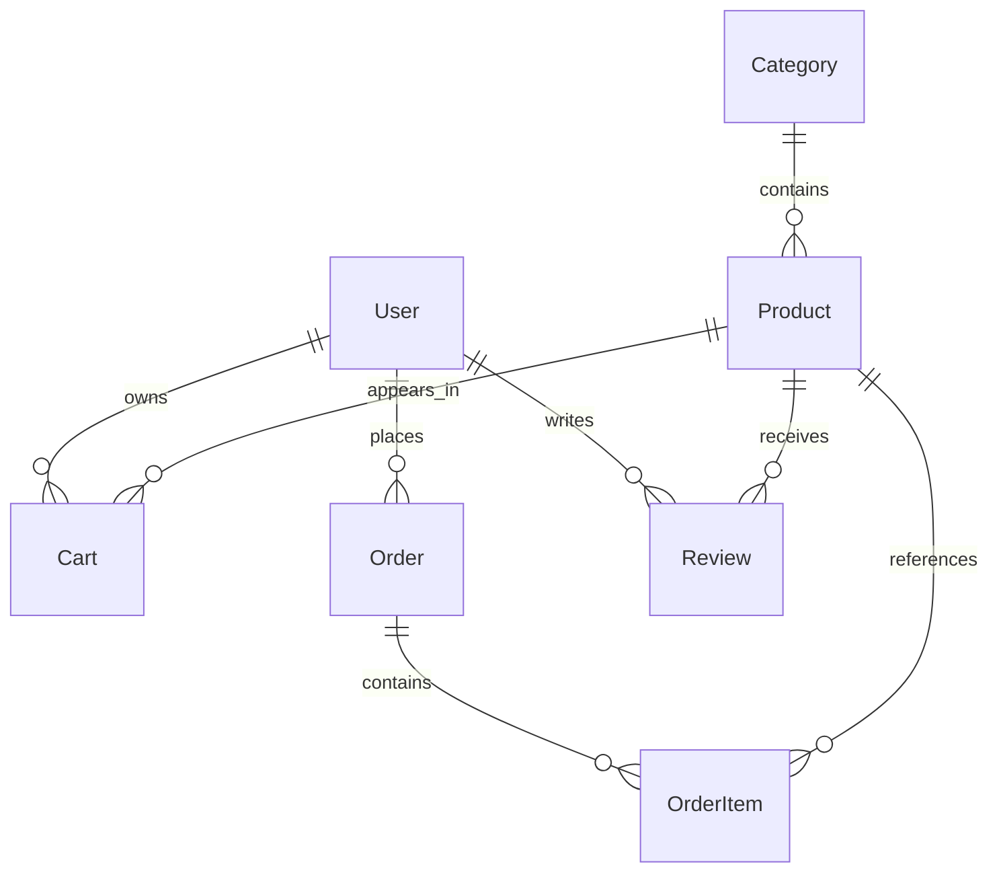

# Phase 2 — PostgreSQL database design

The complete source of truth is `prisma/schema.prisma`. Prisma is already
initialized: `prisma.config.ts` loads the ignored `.env` and selects this schema,
the migration directory and `DATABASE_URL`. Running `prisma init` again would
conflict with this configuration. Prisma 7 reads the datasource URL from the
config rather than the schema. Generated client code remains in
`src/prisma/generated/`, preserving application imports.

## Models and relationships

| Parent | Child | Cardinality | Parent deletion |
|---|---|---|---|
| Category | Product | one to many | Restricted while products exist |
| User | Cart | one to many | Cascade |
| Product | Cart | one to many | Cascade |
| User | Order | one to many | Restricted while orders exist |
| Order | OrderItem | one to many | Restricted while line items exist |
| Product | OrderItem | one to many | Restricted while ordered items exist |
| User | Review | one to many | Cascade |
| Product | Review | one to many | Cascade |

All foreign keys are enforced by PostgreSQL, with cascading identifier updates.
UUIDs and `updatedAt` values are supplied by Prisma; raw SQL callers must supply
them explicitly. Timestamps are timezone-aware. Defaults use CUSTOMER, DRAFT,
PENDING and quantity 1 where appropriate.

`User.password` maps to the database column `password_hash` and must contain a
bcrypt hash. Never expose it through future API responses. Emails must be trimmed
and lowercased before persistence; a database check enforces that canonical form
and the unique constraint prevents duplicate canonical emails. Phone numbers are
optional strings, not numeric identifiers; they are not assumed to be unique.

Unique constraints cover emails, category/product slugs, user/product cart lines,
user/product reviews and order/product line items. Composite indexes support
category/status catalog listing, stock alerts, customer order history, order/payment
queues and product reviews. Foreign key columns are covered by these indexes or
separate product indexes.

Prices, discounts, order totals and line prices use Decimal(14,2), interpreted as
BDT in this single-currency marketplace. Use Prisma Decimal arithmetic rather than
JavaScript floating-point calculations. `OrderItem.price` is the unit price charged,
not the line total. `productName` is an additional immutable checkout snapshot.
Orders store a JSON shipping-address snapshot, independent of later profile edits.
Snapshot immutability must be enforced in future services; it is not a SQL update prohibition.

Archive products with status ARCHIVED instead of deleting products referenced by
orders. Deleting users with orders is restricted; future account removal should
anonymize personal data under an explicit retention policy. Restrictive order
deletion prevents accidental removal of financial history through parent cascades.
These restrictions do not prohibit deliberate deletion of individual rows by an
administrative database principal.

## PostgreSQL constraints

Prisma's schema does not express CHECK constraints. The initial migration adds:

- Nonnegative, non-NaN monetary amounts and stock.
- Optional discount prices between zero and the original price.
- Positive cart/order-item quantities and ratings from 1 through 5.
- Nonempty names, canonical emails, URL-safe lowercase slugs and bcrypt hash format.
- JSON objects for shipping/profile addresses and non-null image arrays.

Address structure, image URL rules, verified purchases, available stock at checkout,
order state transitions and agreement between totals and line items require future
validated transactional services. CHECK constraints cannot enforce these cross-row
business rules. Use versioned migrations rather than `db push` so SQL checks are retained.

## Migration result in this workspace

- `prisma format`: passed.
- `prisma validate`: passed.
- `prisma generate`: passed.
- `prisma migrate dev --name init`: attempted; returned `Schema engine error`.
- No PostgreSQL service/listener was detected at localhost:5432. The configured
  `.env` still contains placeholder local credentials. No migration was applied to
  that database, and no success or migration-history entry is claimed.
- Generated an initial migration offline with:

```powershell
npx prisma migrate diff --from-empty --to-schema prisma/schema.prisma --script --output prisma/migrations/20260917000100_init/migration.sql
```

Then added the SQL CHECK constraints. Do not regenerate that file in place because
doing so would overwrite the checks. It is a new-database migration, not a script
for adopting preexisting ecommerce tables.

`tests/database.test.ts` executes the actual SQL in isolated PGlite PostgreSQL and
checks constraints, foreign keys, uniqueness, decimal arithmetic, snapshots and
delete behavior. This does not verify hosted connectivity, Prisma migration-engine
execution, shadow database permissions or PostgreSQL server configuration.

## Apply and inspect a real database

From `nexobd-backend`, install locked dependencies and configure your own empty
development PostgreSQL database in `.env`:

```powershell
npm ci
npm run prisma:format
npm run prisma:validate
npm run db:check
npx prisma migrate dev --name init
npx prisma generate
npm run db:status
```

The development database role needs shadow-database creation permissions for
`migrate dev`. The existing init migration will be applied rather than recreated.
For an empty database where shadow-database access is unavailable, apply the
committed migration with `npm run db:deploy`. Production always uses
`prisma migrate deploy`, with a dedicated migration identity where practical;
runtime users should not have schema-changing permissions.

Do not run `migrate reset` against data you intend to preserve. If the target
already contains tables, stop and plan a baseline/import instead of applying this
from-empty migration. No existing frontend Supabase data has been imported.

## Prisma Studio and visual inspection

After applying the migration:

```powershell
npm run db:studio
```

Open the local URL printed by Prisma Studio. Select users, categories, products,
cart_items, orders, order_items or reviews to browse rows and relation columns.
Keep Studio local; it is an administrative database editor, not a deployed app.
For a visual entity relationship diagram, connect pgAdmin or DBeaver to the same
PostgreSQL database and open its ERD view. Those tools display actual tables and
foreign keys, including the constraints applied by the migration.



No APIs were added in Phase 2. Refresh tokens, verification/reset tokens and seller
ownership are intentionally deferred to their authentication/catalog phases.
